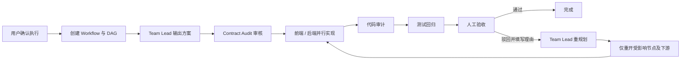
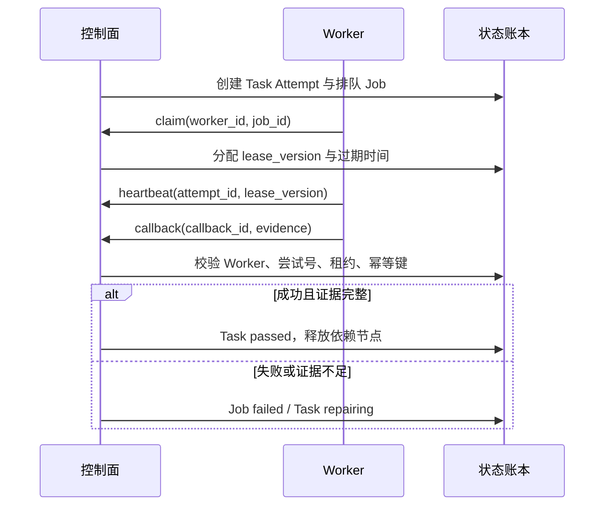

# A2A Agent Office 产品需求文档

## 1. 文档信息

| 项目 | 内容 |
| --- | --- |
| 产品名称 | A2A Agent Office |
| 文档目的 | 向团队说明当前 A2A 控制面如何把一个任务从确认执行推进到人工验收与闭环。 |
| 目标读者 | 产品、前端、后端、测试及参与 A2A Worker 的同事。 |
| 当前版本 | 基于现有 `codex-a2a-team` 实现。 |

## 2. 背景与问题

多 Agent 协作最容易出现两类问题：任务卡看似完成、但没有真实交付证据；或者用户驳回后仍沿用旧结论，未把问题重新分派给正确节点。

本产品提供一个可视化控制面和可校验的 Worker 协议。它将任务、依赖、执行尝试、租约、证据、协作消息、缺陷和人工决定保存为可追溯状态，而不是仅依赖聊天文本。

## 3. 产品目标

1. 用户确认后创建一个可视化的 A2A 工作流，并按任务类型选择最小 DAG。
2. 节点只在依赖完成后进入可执行状态；Worker 只能通过租约领取自己的工作。
3. 交付必须携带可复核证据。构建成功、服务启动或节点开始均不等同于产品验收。
4. 人工验收必须提供真实可操作入口、通过/驳回按钮及必填理由。
5. 驳回后由 Team Lead 重规划，只重开受影响节点及其下游节点。

## 4. 非目标

- 不把本地模拟的模型结果伪装成真实第三方模型调用。
- 不允许 Worker 自行绕过人工验收，将工作流标记为最终完成。
- 不以固定节点数量作为工作流质量标准；节点数量由任务路由与依赖决定。

## 5. 角色

| 角色 | 职责 |
| --- | --- |
| 用户/人工验收人 | 确认任务、实际操作产品、填写理由并做通过或驳回决定。 |
| Team Lead | 澄清范围，拆解任务，维护重新规划策略。 |
| Contract Audit | 审核范围、接口契约和并行开发边界。 |
| Frontend / Backend Worker | 领取被分派的 Job，实现并提交可复核证据。 |
| Audit / Test Worker | 审查变更、执行回归并把结果交给人工验收。 |
| 控制面 | 保存工作流状态、发放租约、校验回写幂等性、释放后续依赖。 |

## 6. 用户主流程

### 6.1 创建与路由

用户提交标题和需求后，控制面创建 `Workflow`。路由器依据需求选择 DAG：

- 一般交付：Team Lead、Contract Audit、前端/后端、代码审计、测试、人工验收。
- 仅前端或仅后端：移除无关开发节点，保留必要的审计、测试和人工验收。
- A2A 流程验证：使用 Team Lead、流程验证、人工验收的最小链路。

因此，看板出现 3、7 或更多节点并不代表异常；节点数量应反映当前任务真实需要的协作角色。

### 6.2 Worker 闭环

Worker 回写必须带上：`worker_id`、`attempt_id`、`lease_version`、`callback_id` 和结果证据。过期租约、旧尝试或重复但不一致的回写会被拒绝，避免旧 Worker 覆盖新状态。

### 6.3 缺陷回派与重规划

发现问题时，审计或测试节点登记 `Defect`，指定责任 Agent 和关联 Task。控制面将责任节点转为 `repairing`，阻塞其下游节点，并排队新的修复 Job。

人工验收驳回与普通缺陷不同：驳回理由首先交给 Team Lead。Team Lead 输出受影响阶段列表后，控制面只重新打开这些阶段及其下游节点，未受影响的已交付节点继续保留证据和状态。

### 6.4 人工验收

当测试通过后，验收任务进入 `acceptance_pending_human`。看板必须展示：

1. 实际可访问的验收地址；
2. 用户应检查的关键结果；
3. 必填的验收理由输入框；
4. “验收通过”和“驳回并退回 Team Lead”两个操作。

系统不得代替用户点击任何最终验收按钮。验收卡和节点详情卡均需限制在当前画布视窗内；内容较长时，卡片内部滚动而不是溢出窗口。

## 7. 看板交互要求

| 场景 | 行为 |
| --- | --- |
| 选择节点 | 详情卡在节点周围的右、左、下、上候选空位中选择不遮挡的位置，并限制最大高度。 |
| 协作日志过长 | 仅右侧日志区域滚动，不能撑高主画布或把验收卡推出视窗。 |
| 状态刷新 | 看板定时拉取工作流详情，展示任务、消息和状态变化。 |
| 验收驳回 | 理由写入账本；Team Lead 收到重规划 Job；仅相关节点重开。 |

## 8. 核心数据与接口

| 资源 | 用途 |
| --- | --- |
| Workflow | 一个用户确认后的协作任务及其 DAG。 |
| Task / TaskAttempt | 节点当前状态和每次执行记录。 |
| WorkerJob | 可领取、可续租、可回写的异步执行单元。 |
| Message | Agent-to-Agent 协作上下文。 |
| Defect | 缺陷内容、责任节点和处理状态。 |
| WorkflowEvent | 用于追溯状态改变的事件账本。 |

关键接口包括：

- `POST /api/workflows`：创建工作流；
- `POST /api/workflows/{id}/tasks/{taskId}/start`：排队节点执行；
- `POST /api/worker/jobs/claim`、`heartbeat`、`callback`：Worker 租约闭环；
- `POST /api/workflows/{id}/defects`：登记缺陷并回派；
- `POST /api/workflows/{id}/acceptance/decision`：记录人工通过或驳回。

## 9. 验收标准

1. 看板状态、Worker Job 与账本回写一致。
2. 过期或不匹配租约不能完成任务。
3. 缺陷可定位责任节点，并重新打开正确的下游链路。
4. 人工验收前，工作流不能完成。
5. 人工验收卡可在当前视窗中实际操作，且用户能打开真实产品地址。
6. 驳回后能看到理由、Team Lead 重规划信息及重新发布的相关节点。

## 10. 当前示例：规则驱动生图工作台

该示例的真实产品链路为：用户输入需求 → 规则匹配 → 结构化 JSON → Prompt → 可替换生成适配器 → 图片与结果 URL → 人工验收。

在没有真实模型密钥时，页面必须明确显示 `local_simulation`；这仍可用于验证规则、参数、Prompt、接口、图片预览和 A2A 验收闭环，但不应被描述为真实生图模型调用。
